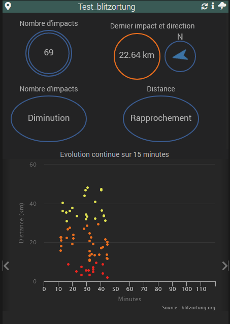

# Documentation du plugin Impacts de foudre (version Bêta)

## Présentation

Ce plugin permet la récupération des impacts de foudre en temps réel à travers le monde via blitzortung.org

## Paramétrage général

Le démon ne pourra démarrer qu'après l'installation, avec succès, des dépendances. Le démon écoute sur le port 56023 par défaut  
Si vous avez un autre processus qui doit tourner sur ce port, vous avez la possibilité de le modifier dans la configuration du plugin

*Attention* : Eviter le niveau de log en debug sans une bonne raison (demande du developpeur) car il y a énormément d'informations entrainant un possible impact sur les performances

## Création et paramétrage d'un équipement

Il est nécéssaire de créer un équipement. Cet équipement sera immediatement opérationel si vous avez configuré, dans Jeedom, vos coordonnées GPS  
  > Pour fonctionner le plugin a besoin de la latitude et de la longitude de votre emplacement

Si vous ne l'avez pas configuré au niveau de Jeedom vous pouvez le faire dans l'équipement  
Au besoin ce site permet de récupérer vos coordonées GPS : <https://torop.net/coordonnees-gps.php>

### Les possibilités de paramétrage sont les suivantes

- Latitude : Latitude de l'emplacement que vous souhaitez surveiller (par défaut : Latitude paramétrée dans Jeedom)
- Longitude : Longitude de l'emplacement que vous souhaitez surveiller (par défaut : Longitude paramétrée dans Jeedom)
- Rayon (km) : [Entre 1 et 200] Le rayon de surveillance autour de vos coordonnées GPS (par défaut : 50 km)  
  *Attention* : Eviter de définir un rayon trop important pour ne pas impacter les performances, il est préférable de créer un autre équipement pour surveiller une autre zone
- Conservation des derniers impacts : [entre 1h et 4h] La durée d'affichage des impacts sur le graphique "distance en fonction de la durée" (par défaut : 1 heure)  
- Visualiser les impacts récents sur : Sur le graphique "distance en fonction de l'angle" les x dernières minutes seront colorées différement pour les repérer  
- Expression déclenchant l'écoute (*) : Lorsque l'expression saisie est vraie, le plugin se mettra à l'écoute des impacts (par défaut : écoute toujours)  
- Facteur de zoom en ouvrant la carte : [Entre 5 et 12] Dnas la barre du widget, un icône "map" permet d'ouvrir la carte Blitzortung centrée sur vos coordonées GPS. Plus la valeur choisie est grande et plus la carte sera zoomée (par défaut : 8)
- Selection du template : Permet d'afficher 3 types de widgets à la place des simples commandes  (par défaut : Horizontal)  
- Graphique par défaut : Affiche le gragphique "Distance en fonction de la durée" ou "Distance en fonction de  l'angle (mode radar)" lors du rechargement du widget (par défault : "Distance en fonction de la durée")

## Informations et principe de fonctionnement

1. Une actualisation est réalisée toutes les 5 minutes pour :  
    - démarrer ou non l'écoute (voivr point 2)  
    - mettre à jour les graphiques  
    - effectuer les calculs d'évolutions et retirer les données dépassant la durée définie dans l'équipement  

2. Au démarrage du démon, le plugin n'écoute pas les évènements venant de Blitzortung et ne démarre l'écoute qu'à la première actualisation suivant le paramètre "Expression déclenchant l'écoute"

    (*) *Point important* :  
    Si le paramètre "Expression déclenchant l'écoute" n'est pas configuré, le plugin écoute les évènements en permanence  
    Il est fortement recommandé de configurer le paramètre "Expression déclenchant l'écoute" pour économiser des ressources systèmes et éviter une connexion permanente sur les serveurs de Blitzortung lorsque ce n'est pas nécéssaire, c'est à dire quand aucun risque d'orage n'est signalé par les services météo. Cette informations est accessible en utilisanant d'autre plugins :  
    > Exemple avec le plugin Météo France (commande [Vigilance - Orages niveau]) : #[Météo][Blitz][Vigilance - Orages niveau] > 1  
    > Exemple avec le plugin Weather (commande [Numéro condition]): #[Météo][Blitz][Numéro condition] < 300  
    
    Il est possible de prendre en compte les 2 conditions :  
    > #[Météo][Blitz][Vigilance - Orages niveau] > 1 || #[Météo][Blitz][Numéro condition] < 300  

3. Lorsque "Expression déclenchant l'écoute" devient vraie ou qu'elle n'est pas paramétrée, le plugin se connecte sur l'un des serveurs Blitzortung et s'y reconnectera automatiquement en cas de déconnexion

4. Les serveurs Blitzortung envoient l'ensemble des données au plugin, c'est à dire dès qu'un impact est detecté à travers le monde !  
Le plugin ne traite que les impacts de foudre qui se trouvent dans le rayon d'action autour des coordonées GPS définies dans l'équipement  
Une bonne partie des ressources est utilisée pour analyser les données reçues et ne les prendre en compte que quand elles concernent la zone définie  

5. Les informations numériques sont indiquées en temps réelle

6. Les graphiques et indicateurs d'évolutions sont actualisés toutes les 5 minutes :  

    Lorsque l'expression déclenchant l'écoute devient vraie, un icône "orage" est affiché dans la barre du widget  
  - Le graphique "Distance en fonction de la durée" montre les impacts de foudre sur la durée définie dans l'équipement. 3 couleurs indiquent des impacts plus ou moins proches :  
    - Rouge si la distance est de 10 km et moins
    - Orange si la distance est de 30 km et moins
    - Jaune dans les autres cas

  - Le graphique "Distance en fonction de  l'angle (mode radar)" montre les impacts de foudre suivant l'angle, permetant de repérer rapidemnt dans quelle zone l'orage sévit autour de vous  
  2 couleurs (plus foncée et plus claire) permettent de différencier les impacts récents des moins récent suivant la durée du paramètre "Visualiser les impacts récents sur"

    Durant cette actualisation le plugin réalise également la moyenne de la quantité des impacts et de leurs distances. Si une variation continue est identifiée sur 15mn, une information sera affichée pour donner l'évolution et les 2 commandes "Evolution des impacts sur 15mn" et "Evolution de la distance sur 15mn" seront mis à jours de la façon suivante :  

    - -1 en cas de diminution du nombre d'impact / d'augmentation de la distance --> L'orage s'éloigne probablement
    - 0 si la variation n'est pas continue ou s'il n'y a pas assez d'informations pour le traitement (aucun impacts dans la durée définie)
    - 1 en cas d'augmentation du nombre d'impact / de diminution de la distance --> L'orage se rapproche probablement

Le template "Horizontal" (par défaut) avec les 2 types de graphique  

Le template "Vertical" avec les 2 types de graphique  

Le template "Minimal" avec les 2 types de graphique  

