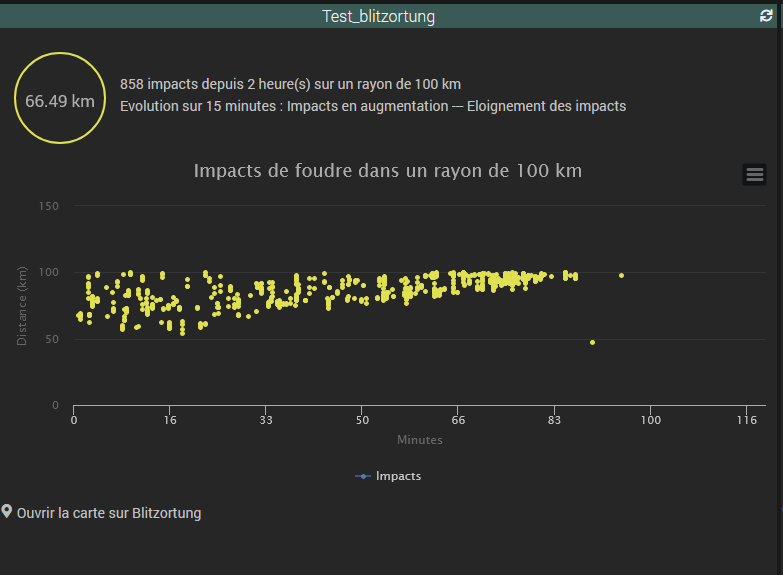

# Documentation du plugin Impacts de foudre (version Stable)

Version stable en phase de validation Jeedom

## Présentation

Ce plugin permet la récupération des impacts de foudre en temps réel à travers le monde via blitzortung.org

## Paramétrage général

Le démon ne pourra démarrer qu'après l'installation, avec succès, des dépendances. Le démon écoute sur le port 56023 par défaut  
Si vous avez un autre processus qui doit tourner sur ce port, vous avez la possibilité de le modifier dans la configuration du plugin

*Attention* : Ne passer pas les logs en debug sans une bonne raison car il y aura énormément d'informations et donc un possible impact sur les performances

## Création et paramétrage d'un équipement

Il est nécéssaire de créer un équipement. Cet équipement sera immediatement opérationel si vous avez configuré, dans Jeedom, vos coordonnées GPS  
  > Pour fonctionner le plugin a besoin de la latitude et de la longitude

Si vous ne l'avez pas configuré au niveau de Jeedom vous pouvez le faire dans l'équipement  
Au besoin ce site permet de récupérer vos coordonées GPS : <https://torop.net/coordonnees-gps.php>

Les possibilités de paramétrage sont les suivantes :

- Latitude : Latitude de l'emplacement que vous souhaitez surveiller (par défaut : Latitude paramétrée dans Jeedom)
- Longitude : Longitude de l'emplacement que vous souhaitez surveiller (par défaut : Longitude paramétrée dans Jeedom)
- Rayon (km) : Le rayon de surveillance autour de vos coordonnées GPS (par défaut : 50 km)  
  *Attention* : Eviter de définir un rayon trop important pour ne pas impacter les performances, il est préférable de créer un autre équipement pour surveiller une autre zone
- Conservation des derniers impacts (entre 1h et 4h) : La durée d'affichage des impacts sur le graphique (par défaut : 1 heure)
- Facteur de zoom en ouvrant la carte (entre 5 et 12) : Sur le widget, un lien permet d'ouvrir une carte Blitzortung centrée sur vos coordonées GPS. Plus la valeur choisie est grande et plus la carte sera zoomée (par défaut : 8)
- Selection du template : Permet d'afficher des widgets à la place des simples commandes  (par défaut : Horizontal)

## Informations et principe de fonctionnement

Le plugin se connecte sur l'un des serveurs de Blitzortung et se reconnectera automatiquement en cas de déconnexion

Le serveur envoi l'ensemble des données au plugin c'est à dire dès qu'un impact est detecté à travers le monde

Le plugin prend en compte les impacts de foudre qui se trouvent dans le rayon d'action autour des coordonées GPS définies dans l'équipement

L'information dans le rond est indiquée en temps réelle, elle indique la distance du dernier impact dans votre zone

Le graphique est actualisé toutes les 5 minutes. Il montre les impacts de foudre sur la durée définie dans l'équipement. 3 couleurs indiquent des impacts plus ou moins proches :

- Rouge si la distance est de 10 km et moins
- Orange sur la distance est de 30 km et moins
- Jaune dans les autres cas

Durant cette actualisation le plugin réalise la moyenne de la quantité des impacts et de leurs distances. Si une variation continue est identifiée sur 15mn, une information sera affichée pour donner l'évolution sur 15mn et les 2 commandes "Evolution des impacts sur 15mn" et "Evolution de la distance sur 15mn" seront mis à jours de la façon suivante :

- -1 en cas de diminution du nombre d'impact / d'augmentation de la distance --> L'orage s'éloigne probablement
- 0 si la variation n'est pas continue ou s'il n'y a pas assez d'informations pour le traitement (aucun impacts dans la durée définie)
- 1 en cas d'augmentation du nombre d'impact / de diminution de la distance --> L'orage se rapproche probablement

