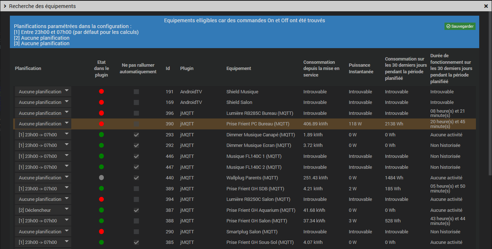

# Documentation du plugin Energy Saver (version Béta)

## Présentation
Ce plugin permet d'aider à stopper certains équipements de votre installation Jeedom durant une fourchette horaire afin d'économiser de l'énergie

**Important** : Les équipements doivent posséder une commande On et une commande Off

## Paramétrage (Configuration)

1. [Obligatoire] Paramétrer au moins une planification (une heure d'arrêt et une heure de remise en service des équipements)
Il est possible d'avoir 3 planifications différentes afin d'éteindre des équipements sur des plages horaires différentes

2. Indiquer si le plugin doit gérer l'arrêt d'un équipement qui viendrait à être rallumé durant la planification  
Note : Ce rallumage ne se fera qu'une seule fois pour éviter un effet ping-pong et notification sera envoyé dans le centre de message de Jeedom si cela arrive

## Utilisation

1. Cliquer sur "Liste des équipements compatibles" pour afficher les équipements possedant des commandes On et Off

Dans la liste des équipements compatibles, plusieurs informations permettent d'aider à savoir si un équipement devrait être géré :
- La consommation globale
- La puissance instantanée (celle disponible lors de l'ouverture de la fenêtre)
- La consommation sur les 30 derniers jours pendant la période programmée
- La durée de fonctionnement sur les 30 derniers jours pendant la période programmée

Par défault (aucune planification selectionnée) le calcul est réalisé à partir des horaires de la planification n°1, sinon le calcul est réalisé sur la planification affectée au plugin. Pour afficher le nouveau calcul il est nécéssaire de sauvegarder, fermer puis ouvrir à nouveau "Liste des équipements compatibles"

Les équipements surlignés en rouge sont ceux non gérés par le plugin et qui présentent assez d'informations (Consommation / Puissance / Etat)

2. Affecter une planification aux équipements souhaitées puis cliquer sur "Sauvegarder" pour que le plugin prenne ces équipements en charge

Aux heures programmées pour l'arrêt les équipements actifs seront éteints  
Aux heures programmées pour la mise en service les équipements actifs seront allumés

3. Une option "Ne pas rallumer l'équipement automatiquement" est disponible pour chaque équipement afin qu'il soit arrêté mais non remis en service

## Informations complémentaires

Un équipement est crée pour chaque équipement pris en charge mais non visible par défault

Un équipement principal est crée pour supporter l'affichage d'un template donc à afficher sur le dashboard ou dans un design
**Important** : Ne supprimez pas cet équipement

**Important** : Par défaut, si un évènement venait à rallumer un équipement durant la période planifiée (scénario, action manuelle, action d'un autre plugin, etc...), Energy Saver ne l'éteindra pas sauf si l'option "Eteindre un équipement qui a été rallumé durant la planification (1 fois)" est coché dans la configuration

## Evolutions envisagées

