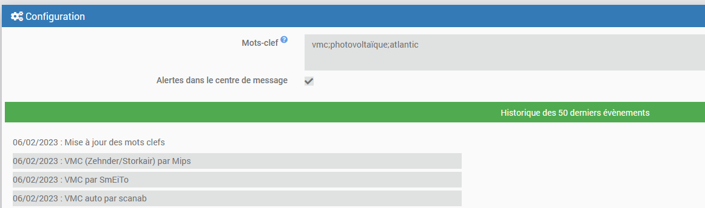

# Documentation du plugin Plugins Utiles (version Bêta)

## Présentation
Configurez des mots-clefs / centres d'intérêt et ce plugin vous permettra de rester informé lors de la sortie d'un plugin correspondant à vos attentes

## Paramétrage et principe de fonctionnement

Aucun équipement n'est associé à ce plugin, tout ce passe dans la partie configuration

Configurer un ou plusieurs mots-clefs séparés par des points-virgules et sauvegarder  
Exemple : vmc;photovoltaïque;atlantic

### Réception des notifications
L'historique des 50 dernières actions (plugins découvert et changement des mots-clefs) sera indiquée dans la partie "Historique" qui se trouve au même niveau que la configuration. Les lignes concernant les plugins sont cliquables afin de voir directement le plugin en question

En cochant la case "Alertes dans le centre de message" vous recevrez, en plus, ces informations dans le centre de message

A chaque sauvegarde de la configuration la recherche sera réalisée sur l'ensembles des plugins existants. Les autres fois la recherche ne sera effectuée que sur les nouveaux plugins

Un plugin déjà signalé ne sera pas signalé à nouveau

### Fréquence de vérification
Une vérification est réalisée :
- Chaque jour lors du cron de minuit
- A chaque sauvegarde de la configuration

