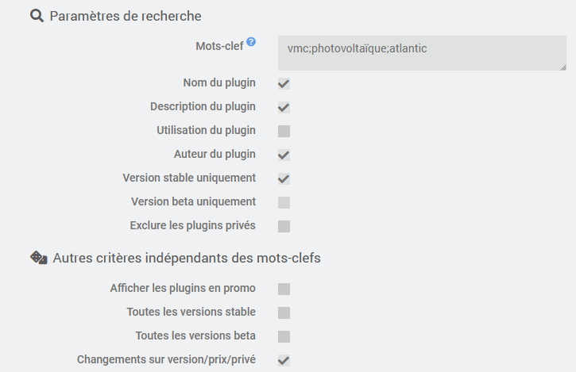
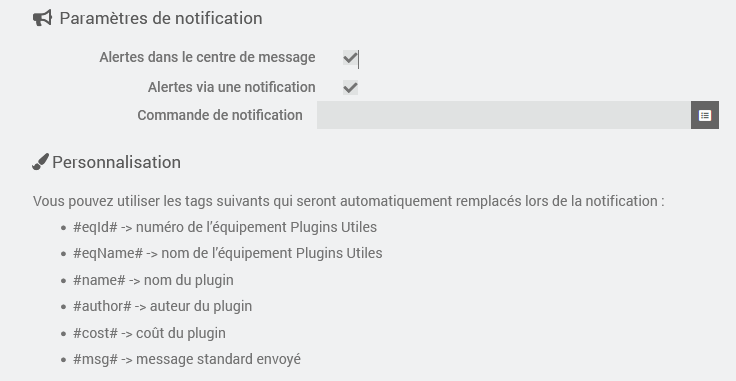

# Documentation de Plugins Utiles (version Bêta)

## Présentation

Configurer des mots-clefs / centres d'intérêt. Plugins Utiles informera lors de la sortie d'un plugin correspondant à vos attentes

## Paramétrage

Créer un équipement et configurer un ou plusieurs mots-clefs séparés par des points-virgules
Exemple : vmc;photovoltaïque;atlantic

La recherche des mots-clefs pourra être réalisée dans le nom, la description, l'utilisation et l'auteur suivant les options selectionnées  
Les options "Version stable uniquement" et "Version beta uniquement" permettent de limiter les résultats

A chaque modification des mots clefs, la recherche sera réalisée sur l'ensembles des plugins existants, sinon la recherche ne sera effectuée que sur les nouveaux plugins

## Réception des notifications

L'historique des évènements (plugins découvert et changement des mots-clefs) sera indiqué dans la partie "Historique des évènements". Les lignes concernant les plugins sont cliquables afin de voir directement le plugin en question

L'option "Alertes dans le centre de message" permet de recevoir des notifications dans le centre de message  
L'option "Alertes via une notification" permet de configurer une commande de votre choix pour l'envoi des notifications

## Compléments d'informations

Si une notification a déjà été envoyée elle ne sera pas envoyée à nouveau

En activant l'option "Changements sur version/prix/privé", une notification sera renvoyée si un changement se produit sur un plugin pour lequel une notification avait déjà été envoyée

## Fréquence de vérification

Une vérification est réalisée :

- Chaque jour lors du cron paramétrée entre 00h00 et 04h59
- Lors de la sauvegarde d'un équipement si la liste des mots-clefs est modifiée
