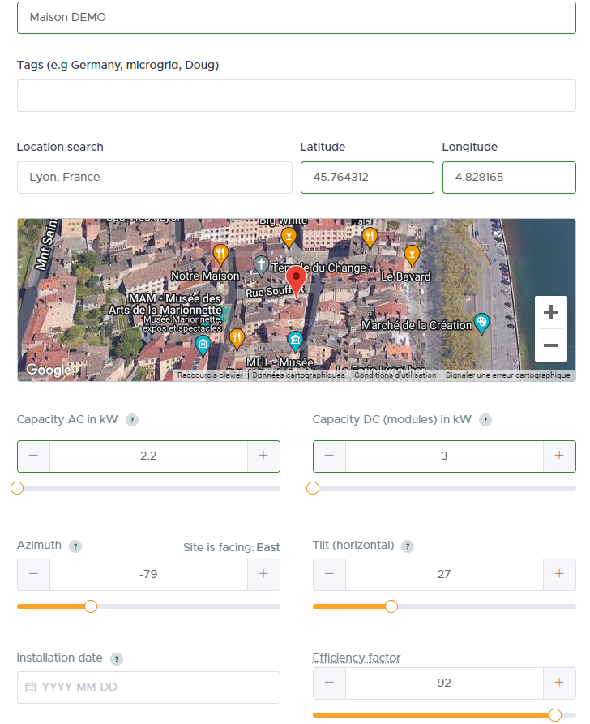

# Documentation du plugin SolCast (version Béta)

## Présentation
Ce plugin permet de récupérer les données de SOLCAST afin de disposer des prévisions de production photovoltaïque (jusqu'à J+4) dans Jeedom
**Il est nécéssaire de créer un compte sur SOLCAST**

## Création d'un compte sur le site SOLCAST
Une fois votre compte crée sur [SOLCAST](solcast.com) il faudra renseigner votre "Rooftop" et le site vous fournira un lien et une clef API correspondant à votre installation photovoltaïque. Il est obligatoire de paramétrer votre site SolCast dans plugin avec ces 2 informations (ressource_id et api_key)

Dans le détail :
1. Créer votre compte de type "My home PV system only" sur [SOLCAST home PV](https://toolkit.solcast.com.au/register/hobbyist)
2. Créer votre "Rooftop" c'est à dire indiquer les données techniques de vos panneaux photovoltaïque (Lattitude, Longitude, AC Capacity, DC Capacity, Azimuth et Tilt)
    - Lattitude et Longitude au format x.y. Exemple pour la tour Eiffel : Lattitude : 48.85823 / Longitude : 2.29457
    - AC Capacity (inverters) à exprimer en kW : indiquer la puissance maximum que peut produire votre installation
    - DC Capacity (modules) à exprimer en kW : indiquer la puissance crête théorique de votre installation
    - Azimuth : Orientation de vos panneaux entre -180 et 180 sachant que 0 est le Nord et 180 le Sud et qu'il faudra indiquer un nombre négatif si les panneaux sont orientés vers l'EST et positif si les panneaux sont orientés vers l'OUEST. Exemple : -90 pour EST et 90 pour OUEST
      > TIPS : vérifier l'orientation de votre toit sur https://www.geoportail.gouv.fr/carte en utilisant "Outils > Mesures > Mesurer un azimut" (tracer un trait en suivant le bord du toit) puis retirer 180 au chiffre obtenu
    - Tilt (Horizontal) : Inclinaison des panneaux par rapport à l'horizontale
    - Efficiency factor : Le pourcentage d'efficacité de votre installation
3. Ouvrir [Live and Forecast](https://toolkit.solcast.com.au/live-forecast) puis cliquer sur "Forecasts". Vous verrez une URL de connexion dans le champs "API"
    - Exemple : "http://api.solcast.com.au/rooftop_sites/**xxxx-xxxx-xxxx-xxxx**/forecasts?format=json"
    - Notez l'information en gras, elle sera à saisir dans le paramètre **Ressource ID** du plugin
4. Dans le menu en haut à droite, cliquer sur "Your API Key" puis sur "Show API Key"
    - Noter votre clef API, elle sera à saisir dans le paramètre **API Key** du plugin

## Création d'un site dans le plugin SolCast
1. Créer un nouveau site coté plugin
2. Renseigner :
    - Ressource ID : Information issue du bloc précédent à l'étape 3
    - API Key : Information issue du bloc précédent à l'étape 4
    - Nombre de jour de prévision : Chiffre entre 1 (par défaut) et 4 correspondant au nombre de jour de prévision. 1 jour correspond au jour en cours. Je recommande de ne pas aller au delà de 2 jours dans un premier temps pour ne pas créer des commandes inutillement

## Commandes disponibles dans le plugin SolCast et principe de fonctionnement
# Commandes pricipales
La quantité de commandes dépend du nombre de jours de prévision choisi dans le plugin  
Les commandes issues de SOLCAST sont les commandes de ce type : "Jour 0 entre 10h et 11h"  
Ces commandes contiennent la quantité de Wh prévue à la fin de la tranche horaire

Le plugin raffraichi les informations chaque heure et 45 minutes (Exemple : 10h45)

Lors du cron de 0h45 ces commandes sont remises à zéro

**Important** : Les commandes antérieures à l'heure du raffraichissement ne sont pas mises à jour (elles ne sont plus communiqué par l'API) c'est à dire que lors du cron de 10h45, la commande "J0 entre 11h et 12h" et les suivantes sont mises à jour mais la commande "J0 entre 10h et 11h" et les précédentes conserveront leurs valeurs

# Commandes secondaires
- Des commandes totalisant le nombre de Wh pour chaque jour

## Utilisation et tips
L'utilisation principale est de connaitre la quantité de Watts qui sera produit pour chaque tranche horaire afin de prévoir de faire fonctioonner des équipements au bon moment (chauffe-eau, pompe, etc ...)

50 requêtes par jour sont possibles sur l'API. Il est possible de créer un second rooftop avec des paramètres un peu différents pour voir si les prévisions se rapprochent de la réalité (inclinaison, puissances AC et DC).
