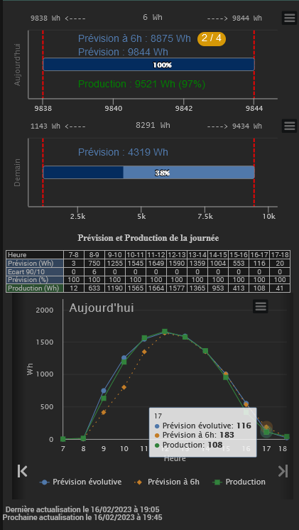
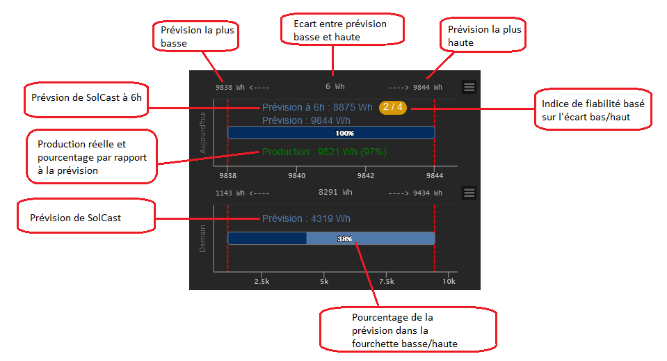
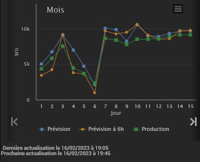
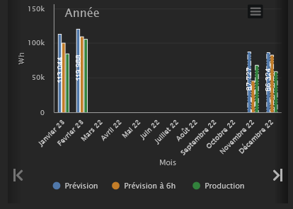
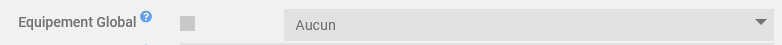
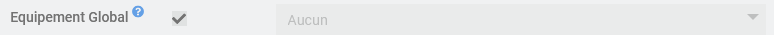
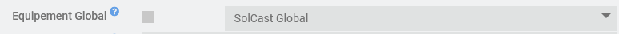

# Documentation du plugin SolCast (version Stable)

## Présentation

Ce plugin permet de récupérer les données de SOLCAST afin de disposer des prévisions de production photovoltaïque (jusqu'à J+4) dans Jeedom
**Il est nécéssaire de créer un compte sur SOLCAST**

## Création d'un compte sur le site SOLCAST

Une fois votre compte créé sur [SOLCAST](https://solcast.com) il faudra renseigner votre "Rooftop" et le site vous fournira un lien et une clef API correspondant à votre installation photovoltaïque. Il est obligatoire de paramétrer votre site SolCast dans le plugin avec ces 2 informations (ressource_id et api_key)

Dans le détail :

1. Créer votre compte de type "My home PV system only" sur [SOLCAST home PV](https://toolkit.solcast.com.au/register/hobbyist)  

3. Créer votre "Rooftop" et indiquer les données techniques de vos panneaux photovoltaïque (Latitude, Longitude, AC Capacity, DC Capacity, Azimuth et Tilt)
    - Latitude et Longitude au format x.y. Exemple pour la tour Eiffel : Latitude : 48.85823 / Longitude : 2.29457
    - AC Capacity (inverters) à exprimer en kW : indiquer la puissance maximum que peut produire votre installation dans la réalité (max vos courbes en été)
    - DC Capacity (modules) à exprimer en kW : indiquer la puissance crête théorique de votre installation
    - Azimuth : Orientation de vos panneaux entre -180 et 180 sachant que 0 correspond au Nord et 180 au Sud et qu'il faudra indiquer un nombre négatif si les panneaux sont orientés vers l'EST et positif si les panneaux sont orientés vers l'OUEST.  
   Exemple : -90 pour EST et 90 pour OUEST  
  
      > TIPS : vérifier l'orientation de votre toit sur <https://www.geoportail.gouv.fr/carte> en utilisant "Outils > Mesures > Mesurer un azimut"  
      > :arrow_right: Tracer un trait depuis le faîtage jusqu'à la goutière en suivant la rive  

      > Si le chiffre obtenu est X alors :
      >
      > - Si les panneaux sont orientés vers l’EST alors indiquer : 0-X
      > - Si les panneaux sont orientés vers l’OUEST alors indiquer : 360-X  
      > Exemple avec une maison dont les panneaux sont orientés vers l'EST :  
        

    - Tilt (Horizontal) : Inclinaison des panneaux par rapport à l'horizontale
    - Efficiency factor : Le pourcentage d'efficacité de votre installation

3. Ouvrir votre Rooftop, le résumé de votre site est à droite :  
    - Copier l'information Ressource Id, elle sera à saisir dans le paramètre **Ressource ID** du plugin  

4. Dans le menu en haut à droite, cliquer sur "Your API Key" puis sur "Show API Key"
    - Noter votre clef API, elle sera à saisir dans le paramètre **API Key** du plugin  

## Création d'un site dans le plugin SolCast

1. Créer un nouveau site côté plugin
2. Renseigner obligatoirement :
    - Ressource ID : Information issue du bloc précédent à l'étape 3
    - API Key : Information issue du bloc précédent à l'étape 4
3. (Optionel) Paramétrage d'un équipement global : voir section "Paramétrage avancée" à la fin de la documentation
4. (Optionnel) Fréquence de raffraichissement des données : Toutes les 2 heures par défaut mais il est possible de demander une actualisation chaque heure si votre abonnement le permet (**Attention laisser ce paramètre par défaut si votre compte ne permet que 10 requêtes**)
5. (Optionnel) Nombre de jour de prévision : Chiffre entre 1 (par défaut) et 4 correspondant au nombre de jour(s) de prévision. 1 jour correspond au jour en cours. Je recommande de ne pas aller au delà de 2 jours dans un premier temps pour ne pas créer des commandes inutilement
6. (Optionnel) Configurer au besoin l'heure de "Début de la prévision" et "Fin de la prévision" pour limiter le nombre de commandes (**Attention si votre compte ne permet que 10 requêtes**)
7. (Optionnel) Choisir le "Niveau de détail des commandes" : Si vous choisissez "Minimal" (par défault) les commandes principales ne seront générées et visibles que pour "Jour 0", même si vous choisissez un nombre de jour de prévision supérieur à 1
8. (Optionnel) Indiquer votre commande d'index de production dans "Commande index total de production"  
**Important** : Cette information doit correspondre à l'index total qui n'est jamais remi à zéro

9. (Optionnel) "Ignorer l'avertissement d'index anormal" permet de ne plus recevoir d'avertissement si l'index de production redescend, ce qui pourrait-être le cas d'une installation qui consomme un peu dirant la nuit.
10. (Optionnel) "Utiliser le template du plugin" permet d'afficher le template du plugin à la place d'une suite de commandes  
11. (Optionnel) "Template horizontal" permet d'afficher le template du plugin de façon plus horizontal pour ête plus adaptée à un affichage sur tablette
12. Les options Ne pas afficher la barre d'information "Aujourd'hui", Ne pas afficher la barre d'information "Demain", Ne pas afficher le tableau de données "Aujourd'hui",Ne pas afficher les graphiques en courbes et Ne pas afficher les informations de dernières actualisation permettent de masquer les éléments repectifs sur le template

Note : Afin d'économiser de la place en largeur, les heures pour lesquelles les données de prévision sont nulles ne sont pas affichées dans le tableau  

Quelques captures et explications des données :  

  

## Cron

Le plugin génère 2 cron :

- Le premier à chaque heure et 45 minutes pour mettre à jour les commandes en fonction des prévisions
- Le deuxieme à chaque et 5 minutes pour mettre à jour les données de production si vous l'avez renseigné

# Commandes principales

La quantité de commandes dépend du nombre de jours de prévision choisi dans le plugin  
Les commandes issues de SOLCAST sont les commandes de ce type : "Jour 0 entre 10h et 11h"  
Ces commandes contiennent la quantité de Wh prévue à la fin de la tranche horaire

Le plugin raffraichi les informations chaque heure et 45 minutes (Exemple : 10h45)

Lors du cron de 0h45 ces commandes sont remises à zéro

**Important** : Les commandes antérieures à l'heure du rafraichissement ne sont pas mises à jour (elles ne sont plus communiquées par l'API) c'est à dire que lors du cron de 10h45, la commande "J0 entre 11h et 12h" et les suivantes sont mises à jour mais la commande "J0 entre 10h et 11h" et les précédentes conserveront leurs valeurs

# Commandes secondaires

- Une commande indiquant la prévision sur l'heure suivante : "Prévision heure suivante"
- Des commandes totalisant la quantité de Wh pour chaque jour : "Prévision J+x"
- Des commandes totalisant la quantité de Wh pour chaque jour dans les cas où il y a plus ou moins de nuages que prévu : "Prévision J+x avec moins de nuages" / "Prévision J+x avec plus de nuages"
- Des commandes indiquant les 3 Tops de la journée avec les valeurs et les heures de fin : "Top x valeur" / "Top x heure de fin"
- 2 commandes "Prévision heure suivante (comparaison)" et "Prévision fin de journée (comparaison)" qui permettent de comparer les prévisions à la production réelle sur une vue car ces commandes sont décalées dans le temps pour donner la valeur au même moment que la valeur de production
- 2 commandes "Prévision J+0 à 6h de la journée complète" et "Prévision J+0 de la journée complète" qui permettent de voir la courbe de prévision de la journée dans un graphique historique dès le début de la journée (Jeedom, JeedomConnect, ...). La courbe à 6h ne bouge pas mais l'autre évoluera avec l'affinage de la prévision au fil des heures.  
Pour les visualiser dans Jeedom il faut "Autoriser les dates dans le futur" (Réglages > Système > Configuration > Equipements)
Pour les visualiser dans Jeedom Connect il faut être en version 1.7.1 et activer le mode "Dates dans le futur" dans le widget Historique

Exemple de vue dans Jeedom :

# Utilisation et pincipes de fonctionnement

L'utilisation principale est de connaitre la quantité de Watts qui sera produite pour chaque tranche horaire afin de prévoir de faire fonctionner des équipements au bon moment (chauffe-eau, pompe, etc ...)  
Un comparatif entre les données du jour et du lendemain permette de reporter ou d'avancer l'utilisation des équipements consommateurs

10 requêtes par jour sont possibles sur l'API depuis le 1er décembre 2022.  
**Attention de définir les paramètres "Début de la prévision" et "Fin de la prévision" en conséquence**  

Si votre compte permet 50 requêtes il est possible de créer un second rooftop avec des paramètres (inclinaison, puissances AC et DC) un peu différents pour voir si les prévisions se rapprochent un peu plus de la réalité.

# Paramétrage avancé

## Configurer plusieurs orientations

Si vous avez la chance d'avoir plusieurs oreintations, il est possible de paramétrer le plugin pour obtenir des données globales.  
Procédure pour 2 orientations, à adapter si vous en avez plusieurs !  

1. Créer l'équipement correspondant à l'orientation n°1 sans toucher au paramétrage puis sauvegarder

2. Créer l'équipement correspondant à l'orientation n°2 sans toucher au paramétrage puis sauvegarder

3. Créer l'équipement global en cochant "Equipement Global" puis sauvegarder

4. Parametrer l'équipement global sur les équipements correspondant aux orientations n°1 et n°2 puis sauvegarder

## Modification des données

Dans la page de configuration d'un équipement, il est possible de modifier les données du graphique "Année", pour réinitialiser les valeurs ou corriger ce qui que vous voulez. A UTILISER EN CONNAISSANCE DE CAUSE.  
Selectionner le mois, le type de données (prévision évolutive, prévision à 6h, production) et la valeur à envoyer. Une valeur non saisie sera considéré comme nulle.  

