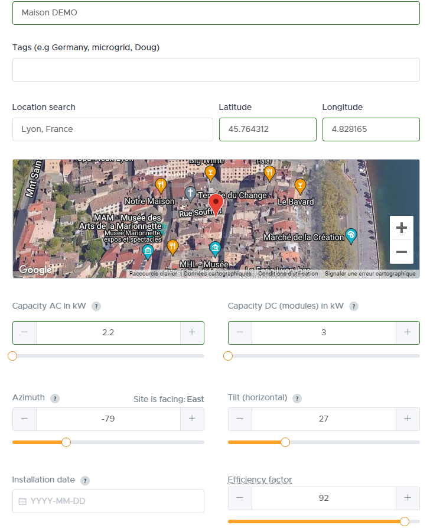

# Documentation du plugin SolCast (version Stable)

## Présentation
Ce plugin permet de récupérer les données de SOLCAST afin de disposer des prévisions de production photovoltaïque (jusqu'à J+4) dans Jeedom
**Il est nécéssaire de créer un compte sur SOLCAST**

## Création d'un compte sur le site SOLCAST
Une fois votre compte créé sur [SOLCAST](https://solcast.com) il faudra renseigner votre "Rooftop" et le site vous fournira un lien et une clef API correspondant à votre installation photovoltaïque. Il est obligatoire de paramétrer votre site SolCast dans plugin avec ces 2 informations (ressource_id et api_key)

Dans le détail :
1. Créer votre compte de type "My home PV system only" sur [SOLCAST home PV](https://toolkit.solcast.com.au/register/hobbyist)
2. Créer votre "Rooftop" c'est à dire indiquer les données techniques de vos panneaux photovoltaïque (Latitude, Longitude, AC Capacity, DC Capacity, Azimuth et Tilt)
    - Latitude et Longitude au format x.y. Exemple pour la tour Eiffel : Latitude : 48.85823 / Longitude : 2.29457
    - AC Capacity (inverters) à exprimer en kW : indiquer la puissance maximum que peut produire votre installation
    - DC Capacity (modules) à exprimer en kW : indiquer la puissance crête théorique de votre installation
    - Azimuth : Orientation de vos panneaux entre -180 et 180 sachant que 0 est le Nord et 180 le Sud et qu'il faudra indiquer un nombre négatif si les panneaux sont orientés vers l'EST et positif si les panneaux sont orientés vers l'OUEST. Exemple : -90 pour EST et 90 pour OUEST
  
      > TIPS : vérifier l'orientation de votre toit sur https://www.geoportail.gouv.fr/carte en utilisant "Outils > Mesures > Mesurer un azimut" (tracer un trait en suivant le bord du toit). Si le chiffre obtenu est X alors : 
      > - Si les panneaux sont orientés vers l’EST alors indiquer : 0-X
      > - Si les panneaux sont orientés vers l’OUEST alors indiquer : 360-X
    - Tilt (Horizontal) : Inclinaison des panneaux par rapport à l'horizontale
    - Efficiency factor : Le pourcentage d'efficacité de votre installation

3. Ouvrir votre Rooftop et vous le résumé de votre site à droite :    
    - Copier l'information Ressource Id, elle sera à saisir dans le paramètre **Ressource ID** du plugin

4. Dans le menu en haut à droite, cliquer sur "Your API Key" puis sur "Show API Key"
    - Noter votre clef API, elle sera à saisir dans le paramètre **API Key** du plugin

## Création d'un site dans le plugin SolCast
1. Créer un nouveau site côté plugin
2. Renseigner obligatoirement :
    - Ressource ID : Information issue du bloc précédent à l'étape 3
    - API Key : Information issue du bloc précédent à l'étape 4
3. (Optionnel) Nombre de jour de prévision : Chiffre entre 1 (par défaut) et 4 correspondant au nombre de jour(s) de prévision. 1 jour correspond au jour en cours. Je recommande de ne pas aller au delà de 2 jours dans un premier temps pour ne pas créer des commandes inutilement
4. (Optionnel) Configurer au besoin l'heure de "Début de la prévision" et "Fin de la prévision" pour limiter le nombre de commandes
5. (Optionnel) Choisir le "Niveau de détail des commandes" : Si vous choisissez "Minimal" (par défault) les commandes principales ne seront générées et visibles que pour "Jour 0", même si vous choisissez un nombre de jour de prévision supérieur à 1
6. (Optionnel) Indiquer votre commande d'index de production dans "Commande index total de production".

**Important** Cette commande correspond à l'index total qui n'est jamais remi à zéro. C'est le plugin qui gère la production qui sera affichée pour la journée
7. (Optionnel) Cocher "Utiliser le template du plugin" permet d'afficher le template du plugin à la place d'une suite de commande d'informations

Exemple :

## Cron

Le plugin génère 2 cron :
- Le premier à chaque heure et 45 minutes pour mettre à jour les commandes en fonction des prévisions
- Le deuxieme à chaque et 5 minutes pour mettre à jour les données de production si vous l'avez renseigné

## Commandes disponibles dans le plugin SolCast et principe de fonctionnement
# Commandes principales
La quantité de commandes dépend du nombre de jours de prévision choisi dans le plugin  
Les commandes issues de SOLCAST sont les commandes de ce type : "Jour 0 entre 10h et 11h"  
Ces commandes contiennent la quantité de Wh prévue à la fin de la tranche horaire

Le plugin raffraichi les informations chaque heure et 45 minutes (Exemple : 10h45)

Lors du cron de 0h45 ces commandes sont remises à zéro

**Important** : Les commandes antérieures à l'heure du rafraichissement ne sont pas mises à jour (elles ne sont plus communiquées par l'API) c'est à dire que lors du cron de 10h45, la commande "J0 entre 11h et 12h" et les suivantes sont mises à jour mais la commande "J0 entre 10h et 11h" et les précédentes conserveront leurs valeurs

# Commandes secondaires
- Une commande indiquant la prévision sur l'heure suivante : "Prévision heure suivante"
- Des commandes totalisant la quantité de Wh pour chaque jour : "Prévision J+x"
- Des commandes totalisant la quantité de Wh pour chaque jour dans les cas où il y a plus ou moins de nuages que prévu : "Prévision J+x avec moins de nuages" / "Prévision J+x avec plus de nuages" (à partir de J+1)
- Des commandes indiquant les 3 Tops de la journée avec les valeurs et les heures de fin : "Top x valeur" / "Top x heure de fin"
- 2 commandes "Prévision heure suivante (comparaison)" et "Prévision fin de journée (comparaison)" qui permettent de comparer les prévisions à la production réelle sur une vue car ces commandes sont décalées dans le temps pour donner la valeur au même moment que la valeur de production

Exemple de vue : 

## Utilisation et tips
L'utilisation principale est de connaitre la quantité de Watts qui sera produite pour chaque tranche horaire afin de prévoir de faire fonctionner des équipements au bon moment (chauffe-eau, pompe, etc ...)

50 requêtes par jour sont possibles sur l'API. Il est possible de créer un second rooftop avec des paramètres un peu différents pour voir si les prévisions se rapprochent de la réalité (inclinaison, puissances AC et DC).

**Attention**
Il semblerait que de nouvelles conditions limite le nombre de requêtes par jour à seulement 10 !

